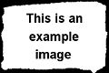

<details>
<summary><b>Navigation</b></summary>

- [HTML notes](#html-notes)
  - [Main structure](#main-structure)
  - [Websites title](#websites-title)
  - [Headers](#headers)
  - [Paragraph](#paragraph)
  - [Line breaker](#line-breaker)
  - [Horizontal rule](#horizontal-rule)
  - [Hyperlinks](#hyperlinks)
  - [Image](#image)
  - [Audio](#audio)
  - [Video](#video)
  - [Text formatting tags](#text-formatting-tags)
  - [Lists](#lists)
    - [Unordered list](#unordered-list)
    - [Ordered list](#ordered-list)
    - [Description list](#description-list)
  - [Tables](#tables)
  - [Colorful page](#colorful-page)
  - [Span and div](#span-and-div)
  - [Metadata](#metadata)
  - [Iframe](#iframe)
  - [Buttons](#buttons)
  - [Forms](#forms)

</details>
<hr>
<a href="https://terraboii.github.io/HTML_notes/"><p><b>Link to the Webpage</b></p></a>
<hr>

<br>

# HTML notes
This contains some useful info about HTML. Some examples are not supported here so you can view [Website]("https://google.com" "Link to the website") \
If you struggle to understand what is written here well this is my notes for HTML.
You can fork it and change it if you like.

<br>

## Main structure

For HTML5:

<br>

```html
<!DOCTYPE html>

<html>

<head>
<!--User does'nt really see whats here-->    
</head>
<body>
<!--What user will see-->
</body>

</html>

```

<p align="right">(<a href="#html-notes" title="to the top of the page">back to top</a>)</p><br>

## Websites title

To change websites title use:

<br>

```html
<title>Title</title>
```

<p align="right">(<a href="#html-notes" title="to the top of the page">back to top</a>)</p><br>

## Headers

You can add up to six different headers to your website:
Example:

<br>
<h1>Header 1</h1>
<h2>Header 2</h2>
<h3>Header 3</h3>
<h4>Header 4</h4>
<h5>Header 5</h5>
<h6>Header 6</h6>
<br>

Code:

<br>

```html
<h1>Header 1</h1>
<h2>Header 1</h2>
<h3>Header 3</h3>
<h4>Header 4</h4>
<h5>Header 5</h5>
<h6>Header 6</h6>
```

<p align="right">(<a href="#html-notes" title="to the top of the page">back to top</a>)</p><br>

## Paragraph

Is an element that has blank line before and after it:

<br>
<p>Paragraph example</p>
<br>

Code:

<br>

```html
<p>Paragraph example</p>
```

<p align="right">(<a href="#html-notes" title="to the top of the page">back to top</a>)</p><br>

## Line breaker
This element doesn't require closing tag. Adds line break 

<br>
<p>Line 1</p>
<br>
<p>Line 2</p>

code:

<br>

```html
<p>Line 1</p>
<br>
<p>Line 2</p>
```

<p align="right">(<a href="#html-notes" title="to the top of the page">back to top</a>)</p><br>

## Horizontal rule
This element doesn't require closing tag. Devides page by sections 

<br>
<hr>
<br>

Code:

<br>

```html
<hr>
```

<p align="right">(<a href="#html-notes" title="to the top of the page">back to top</a>)</p><br>

## Hyperlinks
Element of the page surrounded by `a` tags that refers to something
Has attribute `target`. If you set target to `_blank` link will open in new tab/window, if target is set to `_self` which is default then link will open in current tab. Also there is useful attribute `title` which displays tip box when hover over link. Links can also be used to redirect user to another page. To do so you need to insert path to necessary html file in main one into `href` attribute. \
To begin sending email process you need to insert `mailto:email@email.example` into `href` attribute. \
To begin downloading something after pressing hyperlink insert `path` to the object that you want user to download and add `download` attribute. You can also add name of the file that will be downloaded: `download="file_name"`.

<br>

<a href="images/example.jpg" download="example.jpg">Download example image</a><br>
<a href="https://google.com">Go to 'Google' with no extra attributes</a><br>
<a href="https://google.com" target=_blank>Go to 'Google' with blank</a><br>
<a href="https://google.com" target=_self>Go to 'Google' with self</a><br>
<a href="https://google.com" title="Title">Go to 'Google' with title</a>

<br>

Code:

<br>

```html
<a href="images/example.jpg" download="example.jpg">Download example image</a><br>
<a href="https://google.com">Go to 'Google' with no extra attributes</a><br>
<a href="https://google.com" target=_blank>Go to 'Google' with blank</a><br>
<a href="https://google.com" target=_self>Go to 'Google' with self</a><br>
<a href="https://google.com" title="Title">Go to 'Google' with title</a>
```

<p align="right">(<a href="#html-notes" title="to the top of the page">back to top</a>)</p><br>

## Image
To display images you need to use image element `img` which is self closing tag
and change it's source attribute. Also you can change size of the image. To do so you need to use `width` and `height` attributes (This attributes are in **PIXELS**). In order to scale an image you can change only one attribute. To add alternative text to the image you need to use `alt` attribute. To add a pop up text box use `title` attribute. If you want to add hyperlink to the image simply surround it with `a` tags and add link to `href` attribute of `a` tag. 

<br>

<br>
<a href="https://commons.wikimedia.org/wiki/Example_images"></a><br>


<br>

Code:

<br>

```html
<br>
<a href="https://commons.wikimedia.org/wiki/Example_images"></a><br>
<br>

```

<p align="right">(<a href="#html-notes" title="to the top of the page">back to top</a>)</p><br>

## Audio
To add audio files to your page use `audio` element (It has closing tag between which you can list sources in case one is not supported by browser).
You can add controls to an audio with `controls` attribute. You can make it auto play with `autoplay` attribute as well as muted (`muted`) and looped (`loop`). \
HTML5 supports: `.mp3`, `.wav` and `.ogg`. Maybe more.

<br>

Check [website's page 2](https://terraboii.github.io/HTML_notes/page2.html "website's page 2").

<br>

Code:

<br>

```html
<audio controls src="/sample3.mp3"></audio>
<audio controls src="/sample3.mp3" autoplay muted loop></audio>
<audio controls>
    <source src="/sample3.mp3">
    <source src="/sample3.wav">
    This browser does not support HTML5
</audio>
```

<p align="right">(<a href="#html-notes" title="to the top of the page">back to top</a>)</p><br>

## Video
`.mp4`, `.ogg` and `.webM` maybe some more. is quite similar to [Audio](#audio) and [Image](#image). Has closing tag which functions as [Audio's](#audio)

<br>

Check [website's page 2](https://terraboii.github.io/HTML_notes/page2.html "website's page 2").

<br>

Code:

<br>

```html
<video controls autoplay muted loop src="sample_960x400_ocean_with_audio.mp4" width="400"><br>
```

<p align="right">(<a href="#html-notes" title="to the top of the page">back to top</a>)</p><br>

## Text formatting tags
Some of them.

<br>

<p>This is normal text</p>
<p>This is <b>bold</b> text</p>
<p>This is <i>italic</i> text</p>
<p>This is <big>big</big> text</p>
<p>This is <small>small</small> text</p>
<p>This is <sub>subscript</sub> text</p>
<p>This is <sup>superscript</sup> text</p>
<p>This is <ins>inserted</ins> text</p>
<p>This is <del>deleted</del> text</p>
<p>This is <mark>marked</mark> text</p>
<br>
Code:

<br>

```html
<p>This is normal text</p>
<p>This is <b>bold</b> text</p>
<p>This is <i>italic</i> text</p>
<p>This is <big>big</big> text</p>
<p>This is <small>small</small> text</p>
<p>This is <sub>subscript</sub> text</p>
<p>This is <sup>superscript</sup> text</p>
<p>This is <ins>inserted</ins> text</p>
<p>This is <del>deleted</del> text</p>
<p>This is <mark>marked</mark> text</p>
```

<p align="right">(<a href="#html-notes" title="to the top of the page">back to top</a>)</p><br>

## Lists 
<br>

### Unordered list
<br>
<ul>
    <li>Item 1</li>
    <li>Item 2</li>
    <li>Item 3
        <ul>
            <li>Subitem 1</li>
        </ul>
    </li>
</ul>
<br>

### Ordered list
<br>
<ol type="1" start="3">
    <li>First
        <ol>
            <li>Subitem 1</li>
        </ol>
    </li>
    <li>Second</li>
    <li>Third</li>
</ol>
<br>

### Description list
<br>
<dl>
    <dt>Term 1</dt>
    <dd>Definition 1</dd>
    <dt>Term 2</dt>
    <dd>Definition 2</dd>
</dl>
<br>

Code:

<br>

```html
<h3>Unordered list</h3>

<ul>
    <li>Item 1</li>
    <li>Item 2</li>
    <li>Item 3
        <ul>
            <li>Subitem 1</li>
        </ul>
    </li>
</ul>

<h3>Ordered list</h3>

<ol type="1" start="3">
    <li>First
        <ol>
            <li>Subitem 1</li>
        </ol>
    </li>
    <li>Second</li>
    <li>Third</li>
</ol>

<h3>Description list</h3>

<dl>
    <dt>Term 1</dt>
    <dd>Definition 1</dd>
    <dt>Term 2</dt>
    <dd>Definition 2</dd>
</dl>
```


<p align="right">(<a href="#html-notes" title="to the top of the page">back to top</a>)</p><br>

## Tables
Is an arrangement of information or data usually represented in rows and columns.

<br>
<details>
<summary title="Some other elements can also have some same attributes">Attributes</summary>
    <ol>
        <li><b>bgcolor</b> - background color</li>
        <li><b>align</b> - aligns text</li>
        <li><b>width</b> - width of an element</li>
        <li><b>height</b> - height of an element</li>
    </ol>
</details>
<br>
<br>
<p>Basic one with border:</p>

<table>
    <tr>
        <th>Table Header 1</th>
        <th>Table Header 2</th>
    </tr>
    <tr>
        <td>Table Data 1</td>
        <td>Table Data 2</td>
    </tr>
</table>
<br>
<p>Modified one:</p>
<table bgcolor="black" border=2px>
    <tr bgcolor="green" align="center" width="200">
        <th width="100">Table Header 1</th>
        <th width="100">Table Header 2</th>
    </tr>
    <tr bgcolor="lightgreen" align="center">
        <td height="50">Table Data 1</td>
        <td height="50">Table Data 2</td>
    </tr>
</table>
<br>

Code:

<br>

```html
<p>Basic one with border:</p>

<table>
    <tr>
        <th>Table Header 1</th>
        <th>Table Header 2</th>
    </tr>
    <tr>
        <td>Table Data 1</td>
        <td>Table Data 2</td>
    </tr>
</table>

<p>Modified one:</p>

<table bgcolor="black" border=2px>
    <tr bgcolor="green" align="center" width="200">
        <th width="100">Table Header 1</th>
        <th width="100">Table Header 2</th>
    </tr>
    <tr bgcolor="lightgreen" align="center">
        <td height="50">Table Data 1</td>
        <td height="50">Table Data 2</td>
    </tr>
</table>
```

<p align="right">(<a href="#html-notes" title="to the top of the page">back to top</a>)</p><br>

## Colorful page
To make things colorful use attribute `style`. To add colors use <u title="black">text</u>, <u title="#000000">hex</u> or <u title="rgb(0, 0, 0)">rgb</u> values.

<br>

Check out [Website's page 3](https://terraboii.github.io/HTML_notes/page3.html "page 3").

<br>

Code (from page 3):

<br>

```html
<body style="background-color: black;">
    <a href="index.html"><h3 style="color: rgb(0, 255, 255);"><b>Go back to main page</b></h3></a>
    <p style="color: blue; font-size: 60px; background-color: #444444;"><b style="color: red;">R</b><i style="color: green;">G</i>B</p>
</body>
```

<p align="right">(<a href="#html-notes" title="to the top of the page">back to top</a>)</p><br>

## Span and div
`span` tag - adds markup to text or portion of a document. \
`div` tag - defines a division of a document.

<br>
<div style="background-color: #666666;">
    <p>
        <span style="color:red;">Lorem ipsum dolor, sit amet consectetur adipisicing elit.</span> Quasi fugiat deleniti tenetur. Adipisci ratione, repudiandae dolorem magni consectetur dolore libero unde velit est quod, delectus nesciunt. Consequuntur, dolore dolorum! Nostrum.
    </p>
    <p>
        Lorem ipsum dolor sit amet, consectetur adipisicing elit. Explicabo quas eveniet fugit laudantium officia quam quos cum, minima dolorum soluta blanditiis sed ut consequatur consectetur. Nostrum quidem eum maiores cupiditate!
    </p>
</div>
<br>

Code:

<br>

```html
<div style="background-color: #666666;">
    <p>
        <span style="color:red;">Lorem ipsum dolor, sit amet consectetur adipisicing elit.</span> Quasi fugiat deleniti tenetur. Adipisci ratione, repudiandae dolorem magni consectetur dolore libero unde velit est quod, delectus nesciunt. Consequuntur, dolore dolorum! Nostrum.
    </p>
    <p>
        Lorem ipsum dolor sit amet, consectetur adipisicing elit. Explicabo quas eveniet fugit laudantium officia quam quos cum, minima dolorum soluta blanditiis sed ut consequatur consectetur. Nostrum quidem eum maiores cupiditate!
    </p>
</div>
```

<p align="right">(<a href="#html-notes" title="to the top of the page">back to top</a>)</p><br>

## Metadata
Is data that gives or describes info about data. Positioned between `head` tags of the document. `meta` tag is self closing tag. \

`meta` tag has `http-equiv`, `charset`, `name` and `content` attributes. Maybe more.

<br>

Code:

<br>

```html
<head>
    <meta name="viewport" content="width=device-width, initial-scale=1.0"> <!-- Adding this tag scales webpage for mobile phone and other devises -->
    <meta name="description" content="HTML examples page"> <!-- description of the webpage -->
    <meta name="keywords" content="HTML, examples, page"> <!-- keywords for search engine optimization -->
    <meta name="author" content="TerraBoii"> <!-- Author -->
    <meta charset="UTF-8"> <!-- Tells browser character encoding you are using -->
    <meta http-equiv="refresh" content="30"> <!-- auto refresh page after '30' seconds -->
</head>
```

<p align="right">(<a href="#html-notes" title="to the top of the page">back to top</a>)</p><br>

## Iframe
`iframe` tag - embed content from another source into an HTML document, ex. used for ads.

<br>

Check [website](https://terraboii.github.io/HTML_notes/ 'website').

<br>

Code:

<br>

```html
<iframe style="border: 0;" src="ad_example.html", height="250", width="500"></iframe>
```

<p align="right">(<a href="#html-notes" title="to the top of the page">back to top</a>)</p><br>

## Buttons
You press them and they do magic. Use `onclick="function_name"` attribute to make button magical. \
Can be disabled with `disabled` attribute.

<br>

Check [website](https://terraboii.github.io/HTML_notes/ 'website').

<br>

Code:

<br>

```html
<button onclick="doMagic()" style="background-color: #666666; color: aqua; border-color: black; border-radius: 10px;">Do magic</button>
<p id="magic" style="font-size: 20px;"><b>Magic doesn't exist!</b></p>

<script>
    function doMagic(){
        document.getElementById("magic").innerHTML = "Magic exists!!!"
    }
</script>
```

<p align="right">(<a href="#html-notes" title="to the top of the page">back to top</a>)</p><br>

## Forms
This element accepts user's input.

<br>

Check [website](https://terraboii.github.io/HTML_notes/ "website").

<br>

Code:

<br>

```html
<form action="action_page.php" method="post">

    <div>
        <label for="name">Name:</label>
        <input id="name" type="text" placeholder="John" required name="name">
    </div>

    <br>

    <div>
        <label for="sname">Surname:</label>
        <input id="sname" type="text" placeholder="Brown" required name="sname">
    </div>

    <br>

    <div>
        <label for="pass">Password:</label>
        <input id="pass" type="password" placeholder="password" required name="pass" minlength="8" maxlength="16">
    </div>

    <br>

    <div>
        <label for="phone">Telephone:</label>
        <input id="phone" type="tel" placeholder="(000)-000-0000" required name="phone" maxlength="16">
    </div>

    <br>

    <div>
        <label for="email">Email:</label>
        <input id="email" type="email" placeholder="example@gmail.com" required name="email">
    </div>

    <br>

    <div>
        <label for="bday">Birthdate:</label>
        <input id="bday" type="date" required name="bday">
    </div>

    <br>

    <div>
        <label for="num">Amount:</label>
        <input id="num" type="number" required name="num" min="0" max="999" value="1">
    </div>

    <br>

    <div>
        <label for="gend">Who are you:</label>
        &ensp;&nbsp;
        <label for="mr">Ms.:</label>
        <input id="mr" type="radio" required name="gend" value="mr">
        &emsp;&ensp;&nbsp;
        <label for="mrs">Mrs.:</label>
        <input id="mrs" type="radio" required name="gend" value="mrs">
        &emsp;&ensp;&nbsp;
        <label for="phd">PhD.:</label>
        <input id="phd" type="radio" required name="gend" value="phd">
    </div>

    <br>

    <div>
        <label for="select">Selected:</label>
        <select id="select" required name="selected">
            <option value="opt1">opt 1</option>
            <option value="opt2">opt 2</option>
            <option value="opt3">opt 3</option>
        </select>
    </div>

    <br>

    <div>
        <label for="chbut1">Checkbutton 1:</label>
        <input id="chbut1" type="checkbox" required name="chbut">
        &emsp;&ensp;&nbsp;
        <label for="chbut2">Checkbutton 2:</label>
        <input id="chbut2" type="checkbox" required name="chbut">
    </div>

    <br>

    <div>
        <input type="reset">
        &emsp;&ensp;&nbsp;
        <input type="submit">
    </div>

</form>
```

<p align="right">(<a href="#html-notes" title="to the top of the page">back to top</a>)</p><br>